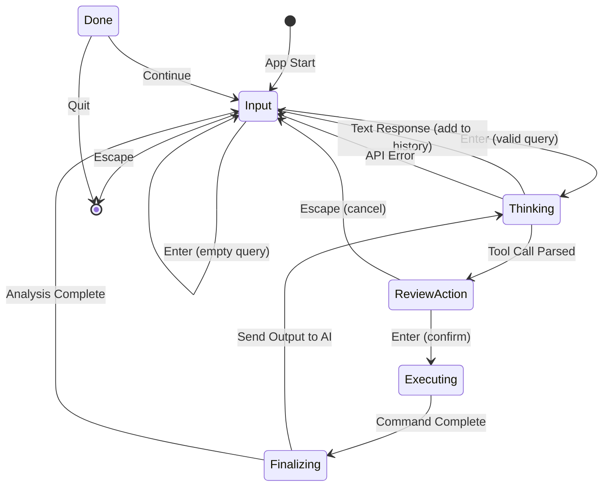

# Design Document: agent-rs

## Overview

**agent-rs** is a Rust-based TUI application implementing the ReAct (Reasoning + Acting) pattern for AI-assisted system administration. The application provides an interactive terminal interface where users can describe tasks in natural language, receive AI-generated shell commands, review and edit them before execution, and get AI-powered analysis of the results.

The architecture follows a state machine pattern with async event handling, ensuring a responsive UI while performing network requests and command execution.

## Architecture

```
┌─────────────────────────────────────────────────────────────────┐
│                         agent-rs                                 │
├─────────────────────────────────────────────────────────────────┤
│  ┌─────────────┐    ┌─────────────┐    ┌─────────────────────┐ │
│  │   TUI Layer │    │ State       │    │ AI Integration      │ │
│  │  (ratatui)  │◄──►│ Machine     │◄──►│ (Gemini API)        │ │
│  └─────────────┘    └─────────────┘    └─────────────────────┘ │
│         │                  │                      │             │
│         ▼                  ▼                      ▼             │
│  ┌─────────────┐    ┌─────────────┐    ┌─────────────────────┐ │
│  │   Event     │    │ Command     │    │ Conversation        │ │
│  │   Handler   │    │ Executor    │    │ History             │ │
│  │  (crossterm)│    │ (std::proc) │    │                     │ │
│  └─────────────┘    └─────────────┘    └─────────────────────┘ │
└─────────────────────────────────────────────────────────────────┘
```

### State Machine Flow



## Components and Interfaces

### 1. App Struct (Core State Container)

```rust
pub struct App {
    /// Current application state
    pub state: AppState,
    
    /// Input textarea for user queries
    pub input_textarea: TextArea<'static>,
    
    /// Editable textarea for command review
    pub action_textarea: TextArea<'static>,
    
    /// Conversation history for AI context (sliding window)
    pub messages: Vec<Message>,
    
    /// Current command being executed
    pub current_command: Option<String>,
    
    /// Output from command execution
    pub execution_output: String,
    
    /// Error message if any
    pub error_message: Option<String>,
    
    /// Spinner frame for loading animation
    pub spinner_frame: usize,
    
    /// Flag to quit application
    pub should_quit: bool,
    
    /// Scroll offset for chat history
    pub scroll_offset: u16,
    
    /// Flag indicating dangerous command detected
    pub dangerous_command_detected: bool,
    
    /// Application configuration
    pub config: Config,
}
```

### 1.1 Config Struct

```rust
#[derive(Debug, Clone, Deserialize)]
pub struct Config {
    /// Gemini API key (from env or config file)
    pub api_key: String,
    
    /// Model name (default: gemini-1.5-flash)
    pub model: String,
    
    /// Maximum messages to keep in history (sliding window)
    pub max_history_messages: usize,
    
    /// Maximum output bytes to capture from commands
    pub max_output_bytes: usize,
    
    /// Maximum output lines to capture
    pub max_output_lines: usize,
    
    /// Dangerous command patterns to warn about
    pub dangerous_patterns: Vec<String>,
}

impl Default for Config {
    fn default() -> Self {
        Self {
            api_key: String::new(),
            model: "gemini-1.5-flash".to_string(),
            max_history_messages: 20,
            max_output_bytes: 50 * 1024, // 50KB
            max_output_lines: 500,
            dangerous_patterns: vec![
                r"rm\s+-rf\s+/".to_string(),
                r"mkfs".to_string(),
                r"dd\s+if=".to_string(),
                r":\(\)\s*\{".to_string(), // fork bomb
                r">\s*/dev/sd".to_string(),
            ],
        }
    }
}

impl Config {
    /// Load config from ~/.config/agent-rs/config.toml or env vars
    pub fn load() -> Result<Self, ConfigError>;
}
```

### 2. AppState Enum

```rust
#[derive(Debug, Clone, PartialEq)]
pub enum AppState {
    /// User typing initial query
    Input,
    
    /// Waiting for AI response (show spinner)
    Thinking,
    
    /// AI proposed a command, user can edit
    ReviewAction,
    
    /// Command is being executed
    Executing,
    
    /// Sending execution result back to AI
    Finalizing,
    
    /// Final summary displayed
    Done,
}
```

### 3. Message Struct (Conversation History)

```rust
#[derive(Debug, Clone, Serialize, Deserialize)]
pub struct Message {
    pub role: MessageRole,
    pub content: String,
}

#[derive(Debug, Clone, Serialize, Deserialize, PartialEq)]
#[serde(rename_all = "lowercase")]
pub enum MessageRole {
    User,
    Model,
    System,
}
```

### 4. Tool Call Struct

```rust
#[derive(Debug, Clone, Serialize, Deserialize)]
pub struct ToolCall {
    pub tool: String,
    pub command: String,
}

impl ToolCall {
    /// Parse AI response for tool call JSON
    pub fn parse(response: &str) -> Option<Self> {
        // Try to find JSON in response
        // Handle both raw JSON and markdown code blocks
    }
}
```

### 5. GeminiClient

```rust
pub struct GeminiClient {
    client: reqwest::Client,
    api_key: String,
    model: String,
    max_history_messages: usize,
}

impl GeminiClient {
    pub fn new(config: &Config) -> Self {
        Self {
            client: reqwest::Client::new(),
            api_key: config.api_key.clone(),
            model: config.model.clone(),
            max_history_messages: config.max_history_messages,
        }
    }
    
    /// Send conversation to Gemini API (with sliding window)
    pub async fn chat(&self, messages: &[Message]) -> Result<String, GeminiError> {
        // Apply sliding window: keep system prompt + last N messages
        let windowed = self.apply_sliding_window(messages);
        // Make API request
    }
    
    /// Apply sliding window to keep context within limits
    fn apply_sliding_window(&self, messages: &[Message]) -> Vec<&Message> {
        // Always keep system prompt (if present)
        // Keep last max_history_messages
    }
}
```

### 6. CommandExecutor

```rust
pub struct CommandExecutor {
    max_output_bytes: usize,
    max_output_lines: usize,
}

impl CommandExecutor {
    pub fn new(config: &Config) -> Self {
        Self {
            max_output_bytes: config.max_output_bytes,
            max_output_lines: config.max_output_lines,
        }
    }
    
    /// Execute a shell command and capture output (with truncation)
    pub fn execute(&self, command: &str) -> CommandResult {
        // Use std::process::Command
        // Capture stdout and stderr
        // Truncate if exceeds limits
        // Return exit code and output
    }
    
    /// Truncate output to configured limits
    fn truncate_output(&self, output: String) -> (String, bool) {
        // Returns (truncated_output, was_truncated)
    }
}

pub struct CommandResult {
    pub stdout: String,
    pub stderr: String,
    pub exit_code: i32,
    pub success: bool,
    pub truncated: bool, // True if output was truncated
}
```

### 6.1 DangerousCommandDetector

```rust
pub struct DangerousCommandDetector {
    patterns: Vec<Regex>,
}

impl DangerousCommandDetector {
    pub fn new(patterns: &[String]) -> Self {
        Self {
            patterns: patterns.iter()
                .filter_map(|p| Regex::new(p).ok())
                .collect(),
        }
    }
    
    /// Check if command matches any dangerous pattern
    pub fn is_dangerous(&self, command: &str) -> bool {
        self.patterns.iter().any(|p| p.is_match(command))
    }
}
```

### 7. Event Handler

```rust
pub enum Event {
    Key(KeyEvent),
    Tick,
    Resize(u16, u16),
    ApiResponse(Result<String, GeminiError>),
    CommandComplete(CommandResult),
}

pub struct EventHandler {
    rx: tokio::sync::mpsc::UnboundedReceiver<Event>,
}

impl EventHandler {
    pub fn new(tick_rate: Duration) -> Self;
    pub async fn next(&mut self) -> Option<Event>;
}
```

## Data Models

### Gemini API Request Format

```rust
#[derive(Serialize)]
pub struct GeminiRequest {
    pub contents: Vec<GeminiContent>,
    pub system_instruction: Option<GeminiSystemInstruction>,
}

#[derive(Serialize)]
pub struct GeminiContent {
    pub role: String,
    pub parts: Vec<GeminiPart>,
}

#[derive(Serialize)]
pub struct GeminiPart {
    pub text: String,
}

#[derive(Serialize)]
pub struct GeminiSystemInstruction {
    pub parts: Vec<GeminiPart>,
}
```

### Gemini API Response Format

```rust
#[derive(Deserialize)]
pub struct GeminiResponse {
    pub candidates: Vec<GeminiCandidate>,
}

#[derive(Deserialize)]
pub struct GeminiCandidate {
    pub content: GeminiContent,
}
```

### System Prompt

```rust
pub const SYSTEM_PROMPT: &str = r#"
You are a macOS/Linux system expert assistant. You help users accomplish system administration tasks.

When the user asks you to perform a system task, you MUST respond with a JSON tool call:
{"tool": "run_cmd", "command": "<shell command here>"}

Rules:
1. Only output the raw JSON when you need to run a command. No markdown, no explanation before it.
2. If you can answer without running a command, just respond with plain text.
3. After seeing command output, provide a clear summary of what happened.
4. Be concise but informative.
5. For dangerous commands (rm -rf, etc.), warn the user in your response.

Examples:
- User: "List all running node processes"
  Response: {"tool": "run_cmd", "command": "pgrep -l node"}

- User: "What's my current directory?"
  Response: {"tool": "run_cmd", "command": "pwd"}

- User: "What is 2+2?"
  Response: 4
"#;
```

## Correctness Properties

*A property is a characteristic or behavior that should hold true across all valid executions of a system-essentially, a formal statement about what the system should do. Properties serve as the bridge between human-readable specifications and machine-verifiable correctness guarantees.*

### Property 1: Empty Input Rejection
*For any* input string composed entirely of whitespace characters, submitting it SHALL NOT change the application state from Input, and the message history SHALL remain unchanged.
**Validates: Requirements 1.3**

### Property 2: Valid Input State Transition
*For any* non-empty, non-whitespace input string, submitting it in Input state SHALL transition the application to Thinking state and add the input to message history.
**Validates: Requirements 1.2**

### Property 3: Tool Call Parsing Round-Trip
*For any* valid ToolCall struct, serializing it to JSON and parsing it back SHALL produce an equivalent ToolCall.
**Validates: Requirements 2.2**

### Property 4: Non-Tool Response Handling
*For any* AI response string that does not contain valid tool call JSON, the response SHALL be added to message history as a Model message and state SHALL transition to Input.
**Validates: Requirements 2.3**

### Property 5: API Error Recovery
*For any* API error during Thinking state, the application SHALL transition back to Input state and set an error message.
**Validates: Requirements 2.4**

### Property 6: Command Display in ReviewAction
*For any* parsed tool call with a command, transitioning to ReviewAction state SHALL populate the action_textarea with that exact command string.
**Validates: Requirements 3.1**

### Property 7: Textarea Edit Consistency
*For any* sequence of valid text editing operations (insert, delete, cursor move) on a TextArea, the resulting content SHALL reflect all operations applied in order.
**Validates: Requirements 3.2**

### Property 8: ReviewAction State Transitions
*For any* application in ReviewAction state, pressing Enter SHALL transition to Executing state, and pressing Escape SHALL transition to Input state with action_textarea cleared.
**Validates: Requirements 3.3, 3.4**

### Property 9: Command Execution Output Capture
*For any* shell command string, executing it SHALL capture both stdout and stderr, and the combined output SHALL be stored in execution_output.
**Validates: Requirements 4.1, 4.2, 4.5**

### Property 10: Feedback Loop Consistency
*For any* completed command execution, the command and its output SHALL be added to message history, and the application SHALL transition to Finalizing then back to Thinking to get AI analysis.
**Validates: Requirements 5.1, 5.2, 5.3**

### Property 11: Message History Append
*For any* new message added to the conversation, the messages vector length SHALL increase by exactly one, and the last element SHALL equal the added message.
**Validates: Requirements 6.1**

### Property 12: Message Role Styling Distinction
*For any* message with a given role (User, Model, System), rendering it SHALL produce visually distinct output (different colors or prefixes) from messages with other roles.
**Validates: Requirements 6.3**

### Property 13: History Serialization Round-Trip
*For any* valid Vec<Message>, serializing it to Gemini API format and deserializing back SHALL preserve the message count, roles, and content.
**Validates: Requirements 6.4**

### Property 14: State Validity
*For any* App instance at any point in execution, the state field SHALL be one of the defined AppState variants, and the UI render function SHALL not panic for that state.
**Validates: Requirements 7.1, 7.2**

### Property 15: Input Blocking in Async States
*For any* application in Thinking or Finalizing state, keyboard input events (except Escape for emergency quit) SHALL NOT modify input_textarea or action_textarea content.
**Validates: Requirements 7.3**

### Property 16: Error State Recovery
*For any* error condition (API failure, command failure, parse failure), the application SHALL transition to a valid state (Input) with error feedback, never to an invalid or stuck state.
**Validates: Requirements 7.4**

### Property 17: State-Dependent Middle Pane Rendering
*For any* application state, the middle pane SHALL render the action_textarea when in ReviewAction, execution_output when in Executing, and be empty/hidden otherwise.
**Validates: Requirements 8.2, 8.3**

### Property 18: Responsive Layout Adaptation
*For any* terminal dimensions (width, height) above minimum thresholds, the layout SHALL render without panic and all panes SHALL have non-zero dimensions.
**Validates: Requirements 8.5**

### Property 19: Output Truncation Safety
*For any* command output exceeding the configured max_output_bytes or max_output_lines, the output SHALL be truncated and the truncated flag SHALL be set to true.
**Validates: Requirements 4.2 (safety extension)**

### Property 20: Dangerous Command Detection
*For any* command string matching a configured dangerous pattern, the dangerous_command_detected flag SHALL be set to true and the UI SHALL display a warning indicator.
**Validates: Requirements 3.5 (safety extension)**

### Property 21: Sliding Window History Management
*For any* conversation with more than max_history_messages, the API request SHALL include only the system prompt plus the most recent max_history_messages, preserving conversation continuity.
**Validates: Requirements 6.4 (memory management extension)**

### Property 22: Config Loading Precedence
*For any* configuration value, environment variables SHALL take precedence over config file values, and config file values SHALL take precedence over defaults.
**Validates: Requirements 2.1 (configuration extension)**

## Error Handling

### Error Types

```rust
// Use thiserror for library-level errors
#[derive(Debug, thiserror::Error)]
pub enum AgentError {
    #[error("API error: {0}")]
    Api(#[from] reqwest::Error),
    
    #[error("JSON parse error: {0}")]
    Parse(#[from] serde_json::Error),
    
    #[error("Command execution error: {0}")]
    Command(String),
    
    #[error("IO error: {0}")]
    Io(#[from] std::io::Error),
    
    #[error("Missing API key")]
    MissingApiKey,
    
    #[error("Config error: {0}")]
    Config(#[from] ConfigError),
}

#[derive(Debug, thiserror::Error)]
pub enum ConfigError {
    #[error("Config file not found")]
    NotFound,
    
    #[error("Invalid config format: {0}")]
    InvalidFormat(String),
    
    #[error("Missing required field: {0}")]
    MissingField(String),
}
```

### Error Recovery Strategy

1. **API Errors**: Display error message, return to Input state, allow retry
2. **Parse Errors**: Treat response as plain text, add to history
3. **Command Errors**: Capture stderr, display to user, send to AI for analysis
4. **IO Errors**: Display error, attempt graceful shutdown
5. **Config Errors**: Fall back to defaults where possible, require API key

### Application-Level Error Handling

Use `anyhow` at the application layer (main.rs) for ergonomic error context:

```rust
use anyhow::{Context, Result};

fn main() -> Result<()> {
    let config = Config::load()
        .context("Failed to load configuration")?;
    
    // ... application logic
}
```

## Testing Strategy

### Dual Testing Approach

This project uses both unit tests and property-based tests for comprehensive coverage:

- **Unit tests**: Verify specific examples, edge cases, and integration points
- **Property-based tests**: Verify universal properties that should hold across all inputs

### Property-Based Testing Framework

**Library**: `proptest` (Rust's most mature PBT library)

**Configuration**: Each property test runs a minimum of 100 iterations.

**Annotation Format**: Each property test includes a comment:
```rust
// **Feature: agent-rs, Property {N}: {property_text}**
```

### Test Categories

#### 1. State Machine Tests
- State transition correctness
- Input validation
- Error recovery paths

#### 2. Parser Tests
- Tool call JSON parsing
- Round-trip serialization
- Edge cases (malformed JSON, embedded JSON)

#### 3. Message History Tests
- Append operations
- Serialization format
- Role distinction

#### 4. Command Execution Tests
- Output capture
- Error handling
- Exit code handling

#### 5. UI Rendering Tests
- State-dependent rendering
- Layout adaptation
- No-panic guarantees

### Test File Structure

```
src/
├── main.rs           # Entry point, anyhow error handling
├── app.rs            # App struct and pure state logic
├── state.rs          # AppState enum and transitions
├── config.rs         # Config loading and validation
├── gemini.rs         # GeminiClient and API types
├── executor.rs       # CommandExecutor and DangerousCommandDetector
├── event.rs          # EventHandler and Event enum
├── ui.rs             # Ratatui rendering (separated from logic)
├── message.rs        # Message types and serialization
└── tests/
    ├── state_tests.rs
    ├── parser_tests.rs
    ├── history_tests.rs
    ├── config_tests.rs
    ├── executor_tests.rs
    └── property_tests.rs
```

### Testing Best Practices

1. **Separate Logic from IO**: Keep state transition logic in pure functions that can be tested without Ratatui
2. **Mock External Dependencies**: Use traits for GeminiClient to enable mocking in tests
3. **Property Test Generators**: Create custom generators for Message, ToolCall, and Config types
4. **Integration Tests**: Test the full ReAct loop with mocked API responses
